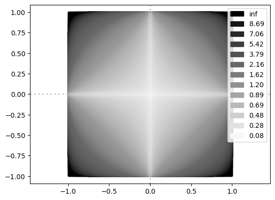

## pNorm visualisation in Python

In 2020, when I commenced the course Foundation of Artificial Intelligence, I accomplished a tiny project by myself to visualise the p-norm realm after doing some research online. The difficulty of this program is that it requires a huge amount of computing resources, especially for the memory (around 20G), even if I did some optimization with engineering skills. It stacks the output images one layer on top of another and trimmed each one to its limit. Of course, there could be other solutions to apply, by using data files or cache for example. The source code is provided in this repository. 

